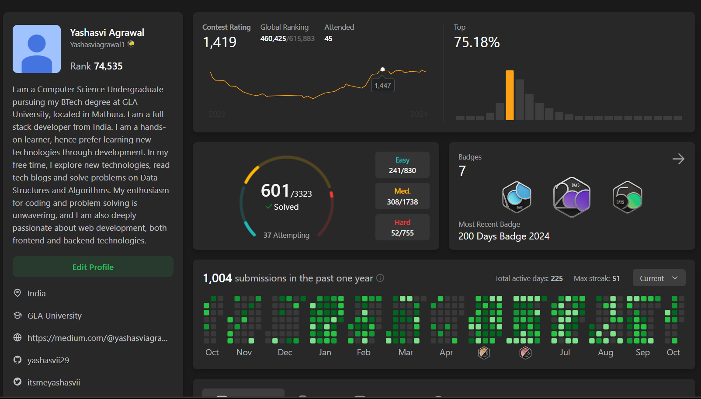

<h1 align="center">Hi 👋, I'm Yashasvi Agrawal</h1>

<h3 align="center">I am a full stack developer from India. I am a hands-on learner, hence prefer learning new technologies through development. In my free time, I explore new technologies, read tech blogs and solve problems on Data Structures and Algorithms.</h3>
  

  

### 🙋‍♂️ More facts about Me!

- 🔭 I’m currently working on [Chat App](https://github.com/yashasvii29/Chat-App)

- 🌱 I’m currently learning **Redux-Toolkit**

- 💬 Ask me about **MERN stack**

- 📫 How to reach me **yashasviagrawal29@gmail.com**

- 🤝  I'm looking to collaborate on Web development and Software development

- 🔥 Always striving to work hard & learn new tools and technologies.
  
- 👯 Looking to connect with people, share ideas and knowledge with them.
  
- 📕 An avid reader, love to travel, watch movies and listen music.

- 🖍I like to solve questions on leetcode, hackerrank and codeforces.

- ⚡You can also contact me on Instagram and Twitter.

- 🙋‍♂️ View my [Portfolio](https://github.com/yashasvii29/Portfolio)

 
 

## :handshake: Followers & Following

 
 

   &nbsp;&nbsp;
   &nbsp;&nbsp;
<!--    &nbsp;&nbsp; -->
   &nbsp;&nbsp
     &nbsp;&nbsp;

 

 
 

## :pushpin: Connect with Me

&nbsp;&nbsp;
&nbsp;&nbsp;
&nbsp;&nbsp;
&nbsp;&nbsp;
&nbsp;&nbsp;
&nbsp;&nbsp;
&nbsp;&nbsp;
&nbsp;&nbsp;
&nbsp;&nbsp;
&nbsp;&nbsp;

 
 

## :computer: My Tech Stack

&nbsp;&nbsp;
&nbsp;&nbsp;
&nbsp;&nbsp;
  &nbsp;&nbsp;
 &nbsp;&nbsp;
 &nbsp;&nbsp;
&nbsp;&nbsp;
&nbsp;&nbsp;
&nbsp;&nbsp;
&nbsp;&nbsp;
 
 
 &nbsp;&nbsp;
&nbsp;&nbsp;
&nbsp;&nbsp;
&nbsp;&nbsp;
&nbsp;&nbsp;
  &nbsp;&nbsp;
&nbsp;&nbsp;
&nbsp;&nbsp;
<!--  -->
<!--  -->
&nbsp;&nbsp;
&nbsp;&nbsp;

 
 

## :heart: All DSA Badges @LeetCode

</img>
</img>
</img>
</img>
</img>
</img>
</img>
</img>

 
 

## :heart: Leetcode Problems Solved @LeetCode

  
&nbsp;

## :computer: Mostly used Languages

 
 

 
 

 
 

 
 

## :star: My GitHub Stats

&nbsp;

 
 

 
 

## :technologist: LeetCode Profile

 
 

